# Backend Runtime Architecture

Status: Descriptive — documents the existing backend process model

Date: 2026-07-24

## Context

The `server/` workspace runs several distinct backend processes: the API, the
indexer, the AI review service + runner, the AI resolution service + runner, and
the clearing keeper (plus a nightly lifecycle harness). A recurring question is
why the two AI subsystems each carry a separate "runner" process — and a service
on top of that — when the indexer and API do not.

The short version: a "runner" is not an AI-specific construct. Every one of
these processes is a long-lived loop that drains a durable source of work and
recovers from a crash by re-reading the database. The indexer is one too — it
drains the chain (its loops are called "watchers"). The only structural
difference is that the two AI subsystems additionally isolate their slow,
failure-prone, internet-facing model call behind a stateless service.

## One pattern

```mermaid
flowchart TB
  classDef seam fill:#E1F5EE,stroke:#0F6E56,color:#04342C
  classDef svc fill:#FAECE7,stroke:#993C1D,color:#4A1B0C
  classDef loop fill:#F1EFE8,stroke:#5F5E5A,color:#2C2C2A

  subgraph L1 [Indexer]
    direction LR
    A1[Blockchain] --> A2[(indexer_cursors)] --> A3[Indexer<br/>8 viem watchers] --> A4[DB rows + change_feed]
  end
  subgraph L2 [API]
    direction LR
    B1[Browser / app] --> B2[(change_feed)] --> B3[API<br/>reads + SSE relay] --> B4[JSON + live push]
  end
  subgraph L3 [AI-review]
    direction LR
    C1[Indexer<br/>writes under_review] --> C2[(market_ai_review_jobs)] --> C3[Review runner<br/>holds manager key] --> C4[on-chain<br/>approve / reject]
    C3 <-->|call| C5[Review service<br/>stateless · internet · no key]
  end
  subgraph L4 [AI-resolution]
    direction LR
    D1[Indexer<br/>writes graduated] --> D2[(market_resolution_jobs)] --> D3[Resolution runner<br/>holds resolver key] --> D4[on-chain<br/>resolve · real money]
    D3 <-->|call| D5[Resolution service<br/>stateless · internet · no key]
  end

  class A2,B2,C2,D2 seam
  class A3,B3,C3,D3 loop
  class C5,D5 svc
```

Read every lane the same way, left to right: a **producer** writes a **durable
table (the seam)**, and a **long-lived loop** drains it. The seam is the
recovery point — the loop keeps no critical state in memory, so a crash resumes
from the table (a cursor, an outbox offset, or a leased job row). The two AI
lanes add one thing the others lack: a **stateless service** (coral) that runs
the slow model/evidence call, connected to the runner by a round-trip call.

- **Teal** — durable seam: the table the loop drains and resumes from.
- **Gray** — long-lived loop (a "runner"): drains the seam; the two at the
  bottom hold a chain private key.
- **Coral** — isolated service: slow, internet-facing, untrusted input, holds no
  chain key and touches no queue.

Note the coupling the lanes share: the indexer is the producer for the other
three lanes. It drains the chain and writes the tables the API relay, the review
runner, and the resolution runner each drain in turn.

## The four subsystems

| | Shape | What triggers it | Drains from | Holds a chain key? | Cardinality (prod) |
|---|---|---|---|---|---|
| Indexer | 1 process (a loop) | chain events + ~15s sweep | the blockchain | no | pinned `1` |
| API | 1 process (a server) | HTTP requests | request socket (+ small `change_feed` drain) | no | autoscales `2–10` |
| AI-review | 2 processes: service + runner | market created → `under_review` | `market_ai_review_jobs` | yes — review-manager key | runner not on AWS yet |
| AI-resolution | 2 processes: service + runner | graduated market's resolution gate passes | `market_resolution_jobs` | yes — distinct resolver key | co-located Fargate task, `1` |

Deployment facts (verified against `infra/lib/popcharts-infra-stack.ts` and
`server/`):

- One Docker image (`server/Dockerfile`) whose default command is the API; every
  other process is selected by overriding the container command. Locally,
  `local-dev.control-plane.yaml` runs each as its own process.
- The backend runs on AWS ECS Fargate, not Vercel — Vercel hosts only the
  Next.js `app/` frontend. "The platform can't run background work" is therefore
  not why the runners are separate.
- The API autoscales (min 2 / max 10) behind an ALB. The indexer and the
  resolution service + runner task are pinned to `desiredCount: 1`. The review
  runner's AWS deployment is still a future slice; today only resolution is wired
  into the stack.
- Ports: API 3001 local / 3000 in-container; AI review service 3002; AI
  resolution service 3004.

## Why the AI subsystems split into a service + a runner

The AI step is, all at once:

- **slow** — model inference plus optional web-evidence collection, seconds to
  minutes;
- **failure-prone** — provider outages, timeouts, malformed output;
- **internet-facing and untrusted** — it fetches public web pages and must treat
  every input (market text, fetched content) as prompt-injection-hostile;
- **independently scalable** — GPU, per-provider rate-limit and cost budgets.

That step is isolated from the part that:

- **holds a chain private key** and submits transactions — `approveMarket` /
  `rejectMarket` with `POPCHARTS_REVIEW_MANAGER_PRIVATE_KEY`; `resolve(side)`
  with the distinct `POPCHARTS_RESOLVER_PRIVATE_KEY`;
- **owns the durable job queue** — leasing (`FOR UPDATE SKIP LOCKED`,
  `lease_until`), retries, backoff;
- **must not lose work** — recovers from the DB after a crash.

Splitting them buys three things:

1. **Trust boundary** (usually the headline reason) — the box that runs
   untrusted web-fetching model calls does not hold the chain key or DB write
   credentials.
2. **Fault isolation** — a service that hangs, OOMs on a large fetch, or crashes
   in the model runtime cannot take the runner's queue-draining loop down with
   it. The runner sees a failed HTTP call, marks the job `retryable_failed`
   (resolution fail-safes to `manual_review`), keeps its lease, and moves on.
3. **Independent scaling** — the model tier scales separately from the cheap
   queue loop.

The indexer has no comparable step to split out: decoding an on-chain log into a
row is fast, deterministic, local, and cannot fail slowly. So it stays a single
process.

## Where the durability actually comes from

Worth stating precisely, because it guides future changes: the runner's
durability comes from the **leased job queue**, not from the service split. A
crashed runner's job is reclaimed when its lease expires; work is recovered from
durable DB state, never from memory. The runner would keep that property even if
the model call were an in-process function. The *separate service* adds fault
isolation, the trust boundary, and independent scaling **on top of** queue-based
durability — it is not the source of the durability.

One-liner: the queue makes it durable; the service split makes it isolated,
secure, and independently scalable.

## Why two runners, not one

Review and resolution are deliberate siblings — same file layout, shared
job-status enums (`server/src/db/schema/job-queue.ts`), reused `safe-web.ts` and
evidence schemas, mirrored `chain-*.ts` submitters. They are kept as separate
processes because they differ on every axis that matters:

| | AI-review | AI-resolution |
|---|---|---|
| Lifecycle stage | gates market **creation** | decides **outcome**, post-graduation |
| On-chain call | `approveMarket` / `rejectMarket` | `resolve(side)` |
| Key | review-manager | distinct resolver key |
| Blast radius | burns one market's creation | mispays real money to holders |
| Status projection | runner does the guarded `markets` UPDATE | the indexer's `MarketResolved` / `MarketCancelled` watcher does it (operator override and self-resolve are also actors) |
| Extra safety | hard-flag reject is final | per-outcome temporal gates, on-chain floor guard, draws-always-manual, 24h operator delay |

They share the pattern, not the process. Merging the two loops would entangle
two keys, two triggers, and two very different risk profiles; resolution is the
highest-stakes automation in the system (an AI holding a resolver key).

## What "combining" would cost

Three distinct combine questions come up:

1. **Fold each service into its runner** (drop the HTTP hop): loses the trust
   boundary (internet-facing model code back in the same process as the chain
   key + DB creds), independent scaling of the model tier, and the offline eval
   seam that hooks the service's HTTP contract (ADR 0019). Defensible only at low
   volume; the split earns its keep at the launchpad's target throughput
   (hundreds–thousands of markets/day).
2. **Fold a runner into the API**: the API is read-only by rule — operator /
   key-holding writes never go through the deployed API — and it autoscales on
   request load, the wrong scaling signal for a queue-draining worker. It would
   also put the chain key on every public replica.
3. **Fold the model call back into the indexer**: the indexer's refusal to call
   the model inline is the reason the runner exists — it writes `under_review` /
   `graduated` and stops; the runner drains it. Folding back would block chain
   ingestion on model latency and provider outages.

The API adopted this same drain-the-durable-table pattern the one time it needed
background work: the SSE relay (ADR 0021) tails `change_feed`, an outbox the
indexer writes in the same transaction as each indexed event.

## Status notes and known gaps (as of 2026-07-24)

- **Corroboration is not yet wired into the live path.** The multi-run agreement
  policy (ADR 0019, `corroboration.ts` in both runners) is defined and tested but
  not invoked by `processReviewJob` / `processResolutionJob` on this branch —
  each calls the service once and commits, including the irreversible on-chain
  action. Confirm this before relying on corroboration to gate on-chain
  resolution.
- **Review is being redesigned (ADR 0022, accepted direction).** Review-first
  market creation moves review off-chain onto editable Drafts before any market
  exists. In diagram terms, the AI-review lane's endpoints change: the producer
  is no longer the indexer writing `under_review`, and the on-chain
  `approve / reject` output (and `POPCHARTS_REVIEW_MANAGER_PRIVATE_KEY`) go
  away — the runner applies verdicts as draft-state transitions. The middle two
  boxes (a leased draft-keyed job queue drained by a runner that calls a
  stateless service) survive unchanged. Resolution's lane is unaffected.

## References

- [AI review runner design](ai-review-runner-design.md) — the review runner
- [AI resolution service & runner design](ai-resolution-service-design.md) — the resolution sibling
- [ADR 0006](adr/0006-server-runtime-and-indexer.md) — Bun/Elysia server + viem indexer
- [ADR 0012](adr/0012-ai-assisted-resolution.md) — resolution as a sibling of review
- [ADR 0019](adr/0019-ai-verdict-quality-program.md) — the eval seam and corroboration policy
- [ADR 0021](adr/0021-live-market-updates.md) — the `change_feed` outbox + SSE relay
- [ADR 0022](adr/0022-review-first-market-creation.md) — review moves off-chain onto drafts
- [Architecture](architecture.md) — monorepo workspace map (complementary: this doc is the runtime/process view)
