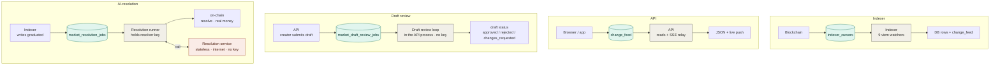

# Backend Runtime Architecture

Status: Descriptive — documents the existing backend process model

Date: 2026-07-24. AI-review lane rewritten against `server/src` on 2026-08-06.

## Context

The `server/` workspace runs several distinct backend processes: the API, the
indexer, the AI resolution service + runner, and the clearing keeper (plus a
nightly lifecycle harness). A recurring question is why the AI resolution
subsystem carries a separate "runner" process — and a service on top of that —
when the indexer and API do not.

The short version: a "runner" is not an AI-specific construct. Every one of
these processes is a long-lived loop that drains a durable source of work and
recovers from a crash by re-reading the database. The indexer is one too — it
drains the chain (its loops are called "watchers"). What resolution adds is the
isolation of its slow, failure-prone, internet-facing model call behind a
stateless service.

AI review used to have the same two-process shape. It no longer does. ADR 0022
moved review off-chain onto drafts, and the loop that drains the draft review
queue now runs **inside the API process** — no separate runner, no chain key,
and no HTTP hop to the review service. That lane is the worked example of when
this pattern's parts are worth dropping, so it is described below as it is, and
the reasoning is in "Why review folded back into the API".

## One pattern

```mermaid
flowchart TB
  classDef seam fill:#E1F5EE,stroke:#0F6E56,color:#04342C
  classDef svc fill:#FAECE7,stroke:#993C1D,color:#4A1B0C
  classDef loop fill:#F1EFE8,stroke:#5F5E5A,color:#2C2C2A

  subgraph L1 [Indexer]
    direction LR
    A1[Blockchain] --> A2[(indexer_cursors)] --> A3[Indexer<br/>9 viem watchers] --> A4[DB rows + change_feed]
  end
  subgraph L2 [API]
    direction LR
    B1[Browser / app] --> B2[(change_feed)] --> B3[API<br/>reads + SSE relay] --> B4[JSON + live push]
  end
  subgraph L3 [Draft review]
    direction LR
    C1[API<br/>creator submits draft] --> C2[(market_draft_review_jobs)] --> C3[Draft review loop<br/>in the API process · no key] --> C4[draft status<br/>approved / rejected / changes_requested]
  end
  subgraph L4 [AI-resolution]
    direction LR
    D1[Indexer<br/>writes graduated] --> D2[(market_resolution_jobs)] --> D3[Resolution runner<br/>holds resolver key] --> D4[on-chain<br/>resolve · real money]
    D3 <-->|call| D5[Resolution service<br/>stateless · internet · no key]
  end

  class A2,B2,C2,D2 seam
  class A3,B3,C3,D3 loop
  class D5 svc
```

Read every lane the same way, left to right: a **producer** writes a **durable
table (the seam)**, and a **long-lived loop** drains it. The seam is the
recovery point — the loop keeps no critical state in memory, so a crash resumes
from the table (a cursor, an outbox offset, or a leased job row). Resolution
adds one thing the others lack: a **stateless service** (coral) that runs the
slow model/evidence call, connected to the runner by a round-trip call.

- **Teal** — durable seam: the table the loop drains and resumes from.
- **Gray** — long-lived loop (a "runner"): drains the seam. Only the resolution
  runner holds a chain private key.
- **Coral** — isolated service: slow, internet-facing, untrusted input, holds no
  chain key and touches no queue.

Two couplings are worth noting. The indexer is the producer for the API and
resolution lanes: it drains the chain and writes the tables they drain in turn.
Draft review is the exception — its producer is the API itself, because a draft
never touches the chain, so there is no event for the indexer to see.

The draft review lane has no coral box. Its loop calls `reviewMarket()` in
process rather than over HTTP. The stateless AI review service still exists
(`server/src/ai-review/server.ts`, port 3002, `bun run start:ai-review`, and the
`review-service` process in `local-dev.control-plane.yaml`), but nothing in the
live path calls it: no server code reads `AI_REVIEW_SERVICE_URL`, and its only
remaining HTTP caller is the offline eval harness
(`server/src/ai-review/evals/run-review-evals.ts`). It is not deployed on AWS.

## The four subsystems

| | Shape | What triggers it | Drains from | Holds a chain key? | Cardinality (prod) |
|---|---|---|---|---|---|
| Indexer | 1 process (a loop) | chain events + ~15s sweep | the blockchain | no | pinned `1` |
| API | 1 process (a server) | HTTP requests | request socket (+ small `change_feed` drain) | no | autoscales `2–10` |
| Draft review | no process of its own — a loop inside the API | creator submits a draft | `market_draft_review_jobs` | no | rides the API, `2–10` |
| AI-resolution | 2 processes: service + runner | graduated market's resolution gate passes | `market_resolution_jobs` | yes — distinct resolver key | co-located Fargate task, `1` |

Draft review is the one lane whose loop is not its own process.
`server/src/api/index.ts:44` calls `startDraftReviewRunner()` when the API runs
as the main module, so every API replica polls the queue. That is safe for the
same reason two runner processes would be: a claim is a leased
`FOR UPDATE SKIP LOCKED` update, and completion is fenced on the runner still
holding its lease. A job is applied at most once however many replicas are up.

Deployment facts (verified against `infra/lib/popcharts-infra-stack.ts` and
`server/`):

- One Docker image (`server/Dockerfile`) whose default command is the API; every
  other process is selected by overriding the container command. Locally,
  `local-dev.control-plane.yaml` runs each as its own process.
- The backend runs on AWS ECS Fargate, not Vercel — Vercel hosts only the
  Next.js `app/` frontend. "The platform can't run background work" is therefore
  not why the runners are separate.
- The API autoscales (min 2 / max 10 in production) behind an ALB. The indexer
  and the resolution service + runner task are pinned to `desiredCount: 1`.
- Draft review needs no deployment slice of its own. It ships inside the API
  image and runs wherever the API runs, so it is live in every environment the
  API is live in.
- The AI review service has no container in the stack. It is a build target
  (`dist/ai-review`) and a local process, not a deployed one.
- Ports: API 3001 local / 3000 in-container; AI review service 3002; AI
  resolution service 3004.

## Why resolution splits into a service + a runner

The AI step is, all at once:

- **slow** — model inference plus optional web-evidence collection, seconds to
  minutes;
- **failure-prone** — provider outages, timeouts, malformed output;
- **internet-facing and untrusted** — it fetches public web pages and must treat
  every input (market text, fetched content) as prompt-injection-hostile;
- **independently scalable** — GPU, per-provider rate-limit and cost budgets.

That step is isolated from the part that:

- **holds a chain private key** and submits transactions — `resolve(side)` with
  `POPCHARTS_RESOLVER_PRIVATE_KEY`;
- **owns the durable job queue** — leasing (`FOR UPDATE SKIP LOCKED`,
  `lease_until`), retries, backoff;
- **must not lose work** — recovers from the DB after a crash.

Splitting them buys three things:

1. **Trust boundary** (usually the headline reason) — the box that runs
   untrusted web-fetching model calls does not hold the chain key or DB write
   credentials.
2. **Fault isolation** — a service that hangs, OOMs on a large fetch, or crashes
   in the model runtime cannot take the runner's queue-draining loop down with
   it. The runner sees a failed HTTP call, marks the job `retryable_failed`
   (resolution fail-safes to `manual_review`), keeps its lease, and moves on.
3. **Independent scaling** — the model tier scales separately from the cheap
   queue loop.

The indexer has no comparable step to split out: decoding an on-chain log into a
row is fast, deterministic, local, and cannot fail slowly. So it stays a single
process.

## Why review folded back into the API

Review once had the same two-process shape. ADR 0022 removed the reason for it.

The split exists to keep untrusted, internet-facing model code away from a chain
private key. Review no longer has one. ADR 0022 P5 deleted the on-chain review
machinery: `approveMarket` and `rejectMarket` appear nowhere in `server/src`,
nothing reads `POPCHARTS_REVIEW_MANAGER_PRIVATE_KEY`, and a verdict is now a
status update on a draft row. With no key and no on-chain write on the loop
side, the trust boundary had nothing left to protect.

The blast radius moved with it. A wrong review used to burn a market that was
already paid for and on-chain, irreversibly. Now it moves a private, editable
draft between `approved`, `rejected`, and `changes_requested`; the creator edits
and resubmits, which enqueues a fresh job. That is the difference that made
folding acceptable for review and keeps it unacceptable for resolution, where a
wrong call mispays real money to holders.

What survived the fold is the part that carries the durability: the leased job
table, the content-addressed snapshot hash that stops a late verdict applying to
edited text, the backoff, and polling as the recovery path. Only the process
boundary and the HTTP hop went away.

The fold has one real cost: the model call now shares the API process, so a slow
or hung provider spends API resources. The code answers that by defaulting draft
review to the deterministic `heuristic` provider rather than inheriting
`AI_REVIEW_PROVIDER` — `server/src/draft-review/runner.ts:27-46` says so
explicitly, and `POPCHARTS_DRAFT_REVIEW_PROVIDER` is the opt-in to a model. That
default is what keeps the shared process cheap, and it is the thing to revisit
if draft volume or provider latency grows.

Local stacks take that opt-in at the stack seam, not in code:
`scripts/shared/env/buildLocalServerEnv.ts` sets
`POPCHARTS_DRAFT_REVIEW_PROVIDER=claude-cli` (dialed by
`LOCAL_DRAFT_REVIEW_PROVIDER`), so `just local-dev` reviews drafts with the
host's logged-in CLI and no API key. Deployed environments never run that
builder and leave the variable unset, so the in-code heuristic default governs
there — no API credits exist in those environments.

## Where the durability actually comes from

Worth stating precisely, because it guides future changes: the runner's
durability comes from the **leased job queue**, not from the service split. A
crashed runner's job is reclaimed when its lease expires; work is recovered from
durable DB state, never from memory. The runner would keep that property even if
the model call were an in-process function. The *separate service* adds fault
isolation, the trust boundary, and independent scaling **on top of** queue-based
durability — it is not the source of the durability.

One-liner: the queue makes it durable; the service split makes it isolated,
secure, and independently scalable.

## Why review and resolution never merged

Review and resolution are deliberate siblings — shared job-status enums
(`server/src/db/schema/job-queue.ts`), reused `safe-web.ts` and evidence schemas
(`server/src/ai-resolution/evidence.ts` imports both from `src/ai-review/`), and
the same leased-queue shape. They were never merged into one loop, and the fold
of review into the API widened the gap rather than closing it:

| | Draft review | AI-resolution |
|---|---|---|
| Lifecycle stage | gates market **creation** | decides **outcome**, post-graduation |
| Runs as | a loop inside the API process | its own Fargate task: service + runner |
| On-chain call | none | `resolve(side)` |
| Key | none | distinct resolver key |
| Blast radius | moves a private, editable draft between states | mispays real money to holders |
| Status projection | the loop updates the `market_drafts` row | the indexer's `MarketResolved` / `MarketCancelled` watcher does it (operator override and self-resolve are also actors) |
| Extra safety | deterministic hard-flag reject short-circuits before any model call | per-outcome temporal gates, on-chain floor guard, draws-always-manual, 24h operator delay |

They share the pattern, not the process. Merging them would entangle two
triggers and two very different risk profiles, and would put a resolver key in
the same loop as an unauthenticated creator's draft text. Resolution is the
highest-stakes automation in the system — an AI holding a resolver key — and it
is the one lane where none of review's simplifications apply.

## What "combining" would cost

Three distinct combine questions come up. Draft review has now answered the
first two in practice, which is what makes them worth stating precisely rather
than as blanket rules:

1. **Fold the service into its loop** (drop the HTTP hop): costs the trust
   boundary (internet-facing model code back in the same process as the chain
   key + DB creds), independent scaling of the model tier, and the offline eval
   seam that hooks the service's HTTP contract (ADR 0019). Draft review took
   this trade and calls `reviewMarket()` in process; it could, because it has no
   chain key to protect, and the eval seam still runs against the standalone
   service. Resolution has not, and the split earns its keep there.
2. **Fold the loop into the API**: draft review did exactly this. Two of the
   three objections survived it and one did not. The decisive one — it would put
   a chain key on every public replica — simply did not apply, because draft
   review holds no key. The read-only rule survives intact: it bars operator and
   key-holding writes from the deployed API, and a draft status update is
   neither. The scaling mismatch is real and is still being paid: the API
   autoscales on request load, which is the wrong signal for a queue-draining
   worker, so draft review's capacity moves with HTTP traffic rather than with
   queue depth.
3. **Fold the model call back into the indexer**: the indexer's refusal to call
   the model inline is why the resolution runner exists — it writes `graduated`
   and stops; the runner drains it. Folding back would block chain ingestion on
   model latency and provider outages. This never applied to review, whose
   producer is the API, not the indexer.

The API adopted this same drain-the-durable-table pattern the one time it needed
background work: the SSE relay (ADR 0021) tails `change_feed`, an outbox the
indexer writes in the same transaction as each indexed event.

## Status notes and known gaps (rechecked 2026-08-06)

- **Corroboration is still not wired into the live path.** The multi-run
  agreement policy (ADR 0019) survives only in
  `server/src/ai-resolution-runner/corroboration.ts`, which nothing imports
  except its own test. `processResolutionJob` calls the service once and
  commits, including the irreversible on-chain action. Confirm this before
  relying on corroboration to gate on-chain resolution. (The review-side
  `processReviewJob` named in the 2026-07-24 version of this note no longer
  exists.)
- **`server/src/ai-review-runner/` is gone entirely.** Its last two files — an
  orphaned `corroboration.ts` and its test, which had no caller — were deleted
  on 2026-08-06, emptying the directory. Nothing named for the review runner
  remains in `server/src`.
- **ADR 0022 landed, and this doc's 2026-07-24 prediction was half right.** The
  producer did change from the indexer to the API, and the on-chain
  `approve / reject` output and `POPCHARTS_REVIEW_MANAGER_PRIVATE_KEY` did go
  away. What that note got wrong is the middle of the lane: it predicted a
  leased draft-keyed queue "drained by a runner that calls a stateless service."
  The queue survived, but the runner and the service call did not — the loop
  moved into the API process and calls `reviewMarket()` directly. Resolution's
  lane is unaffected, as predicted.

## References

- [Server README](../server/README.md) — the operational reference for how draft
  review actually runs
- [AI review runner design](ai-review-runner-design.md) — **superseded**; the
  design record for the removed review runner
- [AI resolution service & runner design](ai-resolution-service-design.md) — the resolution sibling
- [ADR 0006](adr/0006-server-runtime-and-indexer.md) — Bun/Elysia server + viem indexer
- [ADR 0012](adr/0012-ai-assisted-resolution.md) — resolution as a sibling of review
- [ADR 0019](adr/0019-ai-verdict-quality-program.md) — the eval seam and corroboration policy
- [ADR 0021](adr/0021-live-market-updates.md) — the `change_feed` outbox + SSE relay
- [ADR 0022](adr/0022-review-first-market-creation.md) — review moves off-chain onto drafts
- [Architecture](architecture.md) — monorepo workspace map (complementary: this doc is the runtime/process view)
