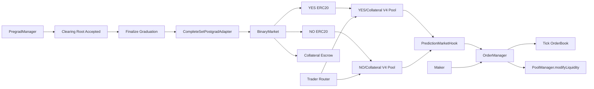

# Complete-Set V4 Hook And Order Manager Plan

Status: implementation in progress; Phase 3 complete-set hardening completed on
2026-06-23.

This is the implementation plan for a full complete-set post-graduation trading
venue on Arc Testnet: per-market ERC20 YES/NO tokens, two Uniswap v4 pools per
market, a prediction-market hook, and an order manager that turns maker orders
into v4 concentrated-liquidity positions.

The older `complete-set-postgrad-plan.md` answers the first-pass questions:
whether the external reference protocol uses Gnosis CTF, whether Arc appears to
have v4 deployed, and how an ERC20 complete-set market fits Pop Charts. This
document assumes that direction and expands it into an implementation blueprint.

## Executive Recommendation

Build a slim Pop Charts complete-set v4 venue, but do not rewrite
Uniswap v4 core.

"Slim" should mean:

- deploy only the v4 stack pieces we need on Arc Testnet
- build a smaller Pop Charts hook and order manager than the production reference
  contracts
- keep oracle/council/bond/tokenomics code out of scope
- keep the protocol handoff boundary receipt-centric and Pop Charts-specific

"Slim" should not mean:

- hand-roll a v4-like AMM
- fork v4 core logic casually
- make the hook/order-manager semantics incompatible with real v4 pools

The practical Arc Testnet target is:

1. Self-deploy canonical Uniswap v4 core/periphery pieces on Arc Testnet unless
   an official Arc deployment appears before implementation.
2. Deploy a Pop Charts complete-set binary market with ERC20 YES and NO tokens.
3. Initialize two v4 pools per graduated market: `YES/collateral` and
   `NO/collateral`.
4. Attach one Pop Charts hook to both pools.
5. Route swaps through a v4-compatible router.
6. Route maker limit orders through a Pop Charts order manager that adds,
   removes, and tracks v4 concentrated-liquidity positions.
7. Seed Arc Testnet with fake/dev liquidity and keeper wallets so the venue is
   usable immediately during testnet.

This is a large protocol surface. The safest one-shot path is still phased:
each phase should leave a deployed or tested artifact, and the final Arc
deployment should consume the manifests generated by the earlier phases.

## Grill Notes And Default Answers

The plan is directionally right, but it has several places where a rosy reading
could hide real protocol risk. These are the questions that should make us
uncomfortable before we ship the full venue:

1. Are we saying "CTF-style" when we really mean "not Gnosis CTF"?
   - Yes. The Arc Testnet slice uses ERC20 outcome tokens with complete-set
     economics. That is intentionally not ADR 0007's preferred ERC1155
     tokenization, so ADR 0008 records the testnet-only deviation.
2. Are we assuming single-sided retained-claim mints are collateralized claim by
   claim?
   - No. The correct invariant is market-level solvency. Matched collateral
     funds complete-set capacity once, then YES and NO claimants receive the
     appropriate side over time. The market must remain able to pay the larger
     of YES or NO supply before resolution and the winning supply after
     resolution.
3. Are we using v4 before proving our own fixed-payout object is sound?
   - Not anymore. The implementation starts with the complete-set market, then
     moves to v4 imports and hook/order-manager behavior. A broken redemption
     object would make every later v4 test meaningless.
4. Are we pretending the adapter can be finished on this branch?
   - No. The current `PregradManager` has root submission and refund marking,
     but not finalization or Merkle claims. The adapter is blocked until that
     surface exists; this plan should not silently invent it.
5. Are hook fees necessary for the first hooked-pool smoke?
   - No. Fees are deferred. The hook can be mined for only `beforeSwap` and
     `afterSwap` at first; `afterSwapReturnDelta` becomes a later decision when
     fee collection is actually implemented.
6. Are we choosing production collateral before proving Arc quirks?
   - No. Local and first Arc smoke use `MockCollateral`. Public Arc demos can
     move to Arc ERC20 USDC only after its decimal and transfer behavior is
     tested against the exact market contracts.
7. Are broad LP positions allowed to mask a bad order manager?
   - Only as a clearly marked testnet backstop. The maker path must seed through
     the order manager before broad dev LP liquidity counts as a successful
     venue smoke.
8. Are we promising mainnet readiness?
   - No. This is unaudited testnet infrastructure with capped market sizes,
     admin-restricted deployment, and a mandatory revisit of CTF/wrapper/CLOB
     choices before mainnet.

Default implementation assumptions for this branch:

- add ADR 0008 before code moves beyond documentation
- implement `OutcomeToken` and `CompleteSetBinaryMarket` first
- use 18-decimal outcome tokens with explicit collateral/outcome conversion
- reject conversion dust rather than silently rounding user balances
- include retained-collateral funding and controlled retained-side minting, but
  leave the real `PregradManager` adapter for the finalization/claim branch
- defer v4 dependencies, hook mining, order manager, and Arc deployment scripts
  until complete-set tests pass locally

## Mental Model: AMM, Book, Hook, And Order Manager

The AMM pools are not just fallback liquidity after the book is empty. In the
complete-set design, the v4 pool is the execution engine for all trades.

The "book" is a controller around v4 liquidity:

- A maker order deposits token inventory into the order manager.
- The order manager converts the order into a v4 liquidity position over a tick
  range.
- The order book data structure records which order IDs should wake up when the
  pool tick crosses particular thresholds.
- A taker swap executes against the v4 pool liquidity.
- The hook observes that the pool tick moved from `fromTick` to `toTick`.
- The hook calls `OrderManager.movePoolTick(...)`.
- The order manager looks up the order IDs in the crossed tick range, removes
  or adjusts their liquidity, settles filled output to makers, and requeues any
  orders that should remain live.

So the working relationship is:

```txt
taker swap -> v4 pool price moves -> hook sees tick movement
           -> order manager processes crossed maker liquidity
           -> order book state updates
```

There is not a separate CLOB that gets priority over an AMM. The v4 pool is the
venue; the order manager makes v4 liquidity behave like onchain limit orders.

If liquidity at a price runs out, swaps revert, quote poorly, or become
unusable until someone adds more liquidity or places more orders. Complete-set
mint/merge enables arbitrage and solvency, but it does not create depth by
itself.

## Confirmed Research

### Arc Testnet

Arc Testnet network details from Arc docs:

- Chain ID: `5042002`
- RPC: `https://rpc.testnet.arc.network`
- Explorer: `https://testnet.arcscan.app`
- Native gas token: USDC
- ERC20 USDC interface: `0x3600000000000000000000000000000000000000`
- CREATE2 factory: `0x4e59b44847b379578588920cA78FbF26c0B4956C`
- Multicall3: `0xcA11bde05977b3631167028862bE2a173976CA11`
- Permit2: `0x000000000022D473030F116dDEE9F6B43aC78BA3`

Arc has an unusual native USDC model. Native USDC uses 18 decimals for gas and
native-value accounting, while the ERC20 USDC interface uses 6 decimals for
application transfers and allowances. Do not mix raw native and ERC20 amounts.
For this plan, the v4 pools should use an ERC20 collateral interface, not
native value, unless we explicitly prototype native currency support.

Fresh RPC bytecode check:

```txt
checkedAt=2026-06-22T13:54:48.704Z
chainId=5042002
block=48172538
    69 bytes Arc CREATE2 Factory 0x4e59b44847b379578588920cA78FbF26c0B4956C
  3808 bytes Arc Multicall3 0xcA11bde05977b3631167028862bE2a173976CA11
  9152 bytes Arc Permit2 0x000000000022D473030F116dDEE9F6B43aC78BA3
     0 bytes Uniswap v4 Ethereum PoolManager 0x000000000004444c5dc75cB358380D2e3dE08A90
     0 bytes Uniswap v4 Ethereum PositionManager 0xbd216513d74c8cf14cf4747e6aaa6420ff64ee9e
     0 bytes Uniswap v4 Ethereum Quoter 0x52f0e24d1c21c8a0cb1e5a5dd6198556bd9e1203
     0 bytes Uniswap v4 Ethereum StateView 0x7ffe42c4a5deea5b0fec41c94c136cf115597227
     0 bytes Uniswap v4 Ethereum Universal Router 0x66a9893cc07d91d95644aedd05d03f95e1dba8af
     0 bytes Uniswap v4 Ethereum Universal Router 2.1.1 0x4c82d1fbfe28c977cbb58d8c7ff8fcf9f70a2cca
     0 bytes Uniswap v4 Unichain PoolManager 0x1f98400000000000000000000000000000000004
     0 bytes Uniswap v4 Base PoolManager 0x498581ff718922c3f8e6a244956af099b2652b2b
     0 bytes Uniswap v4 Sepolia PoolManager 0xE03A1074c86CFeDd5C142C4F04F1a1536e203543
     0 bytes Uniswap v4 Sepolia PositionManager 0x429ba70129df741B2Ca2a85BC3A2a3328e5c09b4
     0 bytes Uniswap v4 Sepolia Quoter 0x61b3f2011a92d183c7dbadbda940a7555ccf9227
     0 bytes Uniswap v4 Sepolia StateView 0xe1dd9c3fa50edb962e442f60dfbc432e24537e4c
     0 bytes Uniswap v4 Sepolia Universal Router 0x3A9D48AB9751398BbFa63ad67599Bb04e4BdF98b
     0 bytes Uniswap v4 Base Sepolia PoolManager 0x05E73354cFDd6745C338b50BcFDfA3Aa6fA03408
     0 bytes Uniswap v4 Base Sepolia PositionManager 0x4b2c77d209d3405f41a037ec6c77f7f5b8e2ca80
     0 bytes Uniswap v4 Base Sepolia Quoter 0x4a6513c898fe1b2d0e78d3b0e0a4a151589b1cba
     0 bytes Uniswap v4 Base Sepolia StateView 0x571291b572ed32ce6751a2cb2486ebee8defb9b4
     0 bytes Uniswap v4 Base Sepolia Universal Router 0x492e6456d9528771018deb9e87ef7750ef184104
     0 bytes Uniswap v4 Unichain Sepolia PoolManager 0x00b036b58a818b1bc34d502d3fe730db729e62ac
     0 bytes Uniswap v4 Unichain Sepolia PositionManager 0xf969aee60879c54baaed9f3ed26147db216fd664
     0 bytes Uniswap v4 Unichain Sepolia Quoter 0x56dcd40a3f2d466f48e7f48bdbe5cc9b92ae4472
     0 bytes Uniswap v4 Unichain Sepolia StateView 0xc199f1072a74d4e905aba1a84d9a45e2546b6222
     0 bytes Uniswap v4 Unichain Sepolia Universal Router 0xf70536b3bcc1bd1a972dc186a2cf84cc6da6be5d
```

Conclusion: as of this check, Arc Testnet has the common helper contracts
needed for a v4 deployment, especially CREATE2 and Permit2, but there is no
confirmed Uniswap v4 deployment at the official/common addresses checked.

### Uniswap v4

Relevant v4 facts:

- v4 uses a singleton `PoolManager`.
- A pool is identified by a `PoolKey`: sorted currencies, LP fee, tick spacing,
  and hook address.
- The hook is specified when `PoolManager.initialize(...)` creates the pool.
- Each pool can have one hook, and one hook can serve many pools.
- Hook permissions are encoded in the hook contract address low bits.
- A v4 integration that directly calls `PoolManager` must implement unlock
  callbacks and settle all nonzero deltas by the end of the lock.
- The Universal Router is the preferred v4 swap path, but a custom/minimal
  router can directly use `PoolManager` if it handles unlock/delta settlement.
- The periphery `PositionManager` manages v4 LP positions as ERC721 NFTs, but a
  custom order manager can use `PoolManager.modifyLiquidity(...)` directly.

The flags relevant to a Complete-set hook are:

```txt
BEFORE_SWAP_FLAG = 1 << 7
AFTER_SWAP_FLAG = 1 << 6
AFTER_SWAP_RETURNS_DELTA_FLAG = 1 << 2
```

The reference hook uses these because the hook needs to record the pre-swap tick, process the
post-swap tick, and optionally return a hook delta for fee collection.

### External Reference Protocol

Reference docs describe a binary prediction-market venue where traders buy YES
or NO tokens, all trades execute onchain through a custom Uniswap v4 hook, and
reference contracts do not take custody of users' YES/NO tokens during trading.

Reference complete-set mechanics:

- anyone can mint YES and NO after market initialization
- depositing 1 TYD mints exactly 1 YES and 1 NO
- before resolution, 1 YES plus 1 NO can be redeemed together for 1 TYD
- after resolution, each winning token redeems for 1 TYD and the losing token
  expires worthless
- each market has two dedicated pools, `YES/TYD` and `NO/TYD`
- The reference implementation constrains pool liquidity between zero and one
  TYD per outcome token

Reference source observations from commit
`7088757b581ab2d1a446dbb5cf8c79de900d77e7`:

- `YesNoToken.sol` is an ERC20 with owner-only minting.
- `TruthMarketV2.sol` stores YES token, NO token, payment token, YES pool key,
  NO pool key, pool IDs, and hook address.
- `TruthMarketV2.mint(...)` transfers payment token in and mints equal YES/NO.
- `TruthMarketV2.burn(...)` burns equal YES/NO and returns payment token before
  finalization.
- `TruthMarketV2.redeem(...)` burns the winning token and returns payment token
  after finalization.
- `TruthMarketV2.withdrawFromCanceledMarket(...)` pays cancelled markets at
  half value across YES and NO balances.
- `TruthMarketHook.sol` implements `beforeSwap` and `afterSwap`.
- `beforeSwap` reads the current tick from `poolManager.getSlot0(...)` and
  stores it transiently.
- `afterSwap` optionally validates the swap, reads the new tick from
  `poolManager.getSlot0(...)`, calls
  `orderManager.movePoolTick(key, fromTick, toTick, sqrtPriceX96)`, and can
  collect a hook fee.
- `TruthMarketSwapValidator.sol` stores lower/upper tick boundaries per pool
  and reverts after a swap if the current tick is outside bounds.
- `OrderManager.sol` stores pending orders, order books, a pool whitelist,
  minimum order amounts, maximum immediate execution count, deferred execution,
  and deferred payment handling.
- `OrderManager.createOrder(...)` validates the pool, tick range, and current
  tick, computes v4 liquidity from the supplied token amount, calls
  `PoolManager.unlock(...)` and `modifyLiquidity(...)`, stores the order, and
  indexes it at one or two threshold ticks.
- `OrderManager.movePoolTick(...)` is callable only by the v4 hook role. It
  collects order IDs in the crossed tick range, executes up to a configured
  maximum, and defers the rest.
- `OrderBook.sol` uses tick bitmaps and packed order IDs to find orders in a
  crossed tick range efficiently.

Takeaway: the reference order manager is not a traditional offchain CLOB. It is an
onchain v4 liquidity order manager. The AMM liquidity and the book are coupled.

## Fit With Pop Charts

Pop Charts pre-graduation receipts remain provisional priced intents. The new
postgrad venue begins only after graduation finalization.

Must preserve:

- no final outcome token before graduation
- receipt escrow equals retained cost plus refund
- retained collateral funds complete sets
- unmatched or crowded-out receipt segments refund exactly
- maximum winner payout is no larger than locked collateral
- users receive postgrad balances through claims, not by transferring receipts

ADR 0007 currently prefers CTF-compatible postgrad infrastructure. A complete-set
v4 venue is CTF-style in economics but not Gnosis CTF in tokenization, because
the reference implementation's public contracts use per-market ERC20 YES/NO
tokens. We should create a new ADR that records this as an Arc Testnet decision
and explicitly keeps a mainnet CTF-wrapper revisit open.

The current protocol branch for this document has `PregradManager` support for
market creation, receipt placement, graduation start, optimistic clearing-root
submission, refund marking, finalization, and Merkle proof claims. The Phase 7
adapter slice wires finalized retained collateral into complete-set postgrad
markets and keeps unmatched refund escrow in `PregradManager`.

## Architecture



### Deployment Surfaces

Arc Testnet deployment manifests:

- `protocol/deployments/arc-testnet.uniswap-v4.json`
- `protocol/deployments/arc-testnet.postgrad.json`
- `protocol/deployments/arc-testnet.complete-set-markets.json`

Contract groups:

- v4 base stack:
  - `PoolManager`
  - `StateView`
  - `V4Quoter`
  - `PositionManager`, optional for LP NFTs and generic seeding
  - `UniversalRouter`, optional but preferred if constructor dependencies are
    resolved cleanly on Arc
  - `MinimalV4SwapRouter`, recommended fallback for testnet if Universal Router
    is too heavy
- Pop Charts postgrad:
  - `OutcomeToken`
  - `CompleteSetBinaryMarket`
  - `CompleteSetMarketFactory`
  - `CompleteSetPostgradAdapter`
- Pop Charts v4 venue:
  - `PredictionMarketHook`
  - `PredictionMarketSwapValidator`
  - `OrderManager`
  - `OrderBook` library
  - `Order` library
  - `OrderValidation` library
  - deferred execution/payment helpers if kept
- operations:
  - deploy/check scripts
  - pool initialization scripts
  - seed liquidity scripts
  - keeper scripts for complete-set arbitrage and deferred execution

## Contract Plan

### OutcomeToken

Purpose: per-market ERC20 for one outcome.

Recommended shape:

- OpenZeppelin ERC20
- immutable market/minter
- `mint(address to, uint256 amount)` callable only by market
- `burnFrom(address from, uint256 amount)` callable by market or approved owner,
  depending on the market's burn/merge/redeem UX
- decimals should be explicit; prefer 18 decimals for outcome tokens unless we
  choose to match USDC at 6 decimals for testnet simplicity

Open question: if collateral is Arc ERC20 USDC with 6 decimals, we must decide
whether 1 YES is `1e18` or `1e6`. The reference implementation converts between
payment-token decimals and outcome-token decimals. That is more flexible but
adds rounding tests. For first implementation, 18-decimal outcome tokens with
explicit conversion is closest to the reference implementation and typical
ERC20 behavior.

### CompleteSetBinaryMarket

Purpose: fully collateralized complete-set market for one graduated Pop Charts
market.

State:

- `collateralToken`
- `yesToken`
- `noToken`
- `collateralDecimals`
- `outcomeDecimals`
- `status`: Trading, Resolved, Cancelled
- `winningSide`: None, Yes, No
- `yesPoolKey`, `noPoolKey`, `yesPoolId`, `noPoolId`
- `hook`
- optional metadata hash / question hash / source market ID

Functions:

- `mintCompleteSets(address to, uint256 collateralAmount)`
  - transfer collateral from caller
  - mint equal YES and NO token amounts to `to`
  - enforce amount conversion and dust policy
- `mergeCompleteSets(uint256 outcomeAmount)`
  - burn equal YES and NO from caller
  - transfer corresponding collateral back before resolution
- `mintFromRetainedCollateral(address to, Side side, uint256 retainedCost)`
  - callable only by postgrad adapter
  - mints the single retained side owed to a claimant
  - must be backed by collateral already transferred from `PregradManager`
- `resolve(Side winningSide)`
  - testnet resolver or optimistic resolver path
- `redeem(uint256 outcomeAmount)`
  - burns winning token
  - pays collateral
- `cancelRedeem(uint256 yesAmount, uint256 noAmount)`
  - optional cancel/draw path at 0.5 collateral per token

Invariant:

```txt
collateral escrow >= redeemable winning supply
```

For unresolved markets, complete-set mint/merge should maintain:

```txt
collateral capacity >= max(yesSupply, noSupply)
```

For Pop Charts retained claims, single-sided minting is allowed only because the
retained collateral for the matching complete set was transferred into the
market through graduation.

### CompleteSetPostgradAdapter

Purpose: bridge `PregradManager` finalization/claims into the ERC20 market.

Responsibilities:

- deploy or reference a `CompleteSetBinaryMarket`
- receive retained collateral from `PregradManager`
- mint retained YES/NO balances to claimants after Merkle proof verification
- emit addresses needed by indexer and frontend
- never compute clearing itself

Adapter boundary:

- `PregradManager` verifies proof and retained/refund accounting.
- Adapter only receives already-approved claim data.
- Adapter should not pull arbitrary collateral from `PregradManager`; the
  manager should transfer the retained collateral and call adapter atomically,
  or the adapter should verify exact received balance deltas.

### PredictionMarketHook

Purpose: v4 hook that makes pools behave like bounded prediction markets and
wakes the order manager when pool ticks move.

Permissions:

```txt
beforeSwap = true
afterSwap = true
afterSwapReturnDelta = true if hook fees are enabled
```

If we do not collect hook fees in the first implementation, we can avoid
`afterSwapReturnDelta` and simplify settlement. But to stay closest to the reference implementation and
leave fee collection available, plan for the flag and return zero until fees
are configured.

State:

- immutable `poolManager`
- `orderManager`
- optional `swapValidator`
- optional `feeCollector`
- `feeNumerator`
- roles: admin, operator
- transient slot for previous tick

Flow:

1. `beforeSwap`
   - read current tick from `poolManager.getSlot0(poolId)`
   - store it transiently
   - return selector and zero delta
2. v4 pool executes swap
3. `afterSwap`
   - run swap validator if configured
   - load previous tick
   - read new `sqrtPriceX96` and tick from `poolManager.getSlot0(poolId)`
   - call `orderManager.movePoolTick(key, fromTick, toTick, sqrtPriceX96)`
   - optionally mint/settle hook fee delta

Security notes:

- Hook `msg.sender` will be `PoolManager`, not the trader. If we need original
  user context in hook data, use a trusted-router pattern.
- Hook deployment must mine the contract address so the low bits match the
  chosen flags.
- Hook should whitelist pools or have the order manager whitelist pools. Do not
  allow arbitrary pools to force order-manager execution.

### PredictionMarketSwapValidator

Purpose: bound each outcome-token pool to a valid prediction-market price range.

State:

- `poolBoundaries[PoolId] = { tickLowerBoundary, tickUpperBoundary, isSet }`

Flow:

- `validateAfterSwap(...)`
  - read current tick
  - compare with configured boundaries
  - revert if out of bounds

Important price detail:

There is no exact finite v4 tick for price 0 or infinity. "0 to 1" must be
implemented as an epsilon-bounded range.

For a pool where displayed price is collateral per 1 outcome token:

```txt
epsilon <= displayedPrice <= 1 - epsilon
```

The implementation must convert displayed price into raw v4 price based on:

- whether collateral is `currency0` or `currency1`
- collateral decimals
- outcome token decimals
- tick spacing

The deployment script should calculate and print both:

- displayed prediction price bounds
- raw v4 ticks and raw sqrt prices

### OrderManager

Purpose: place, cancel, and settle onchain limit-order-like liquidity positions.

This should be a Pop Charts implementation inspired by the external reference protocol, not a blind fork.
The reference design is the reference for core mechanics, but our implementation
should remove production-only features until needed.

State:

- immutable `poolManager`
- immutable `permit2`
- `poolWhitelist[PoolId]`
- `pendingOrders[PoolId][orderId]`
- `orderBooks[PoolId]`
- `minimumOrderAmount[token]`
- `maximumExecutionCount`
- roles:
  - admin
  - hook role
  - whitelist manager
  - order resolver
  - token rescuer

Order model:

```solidity
struct Order {
  address owner;
  bool zeroForOne;
  int24 tickLower;
  int24 tickUpper;
  uint256 liquidity;
  bool enablePartialFill;
}
```

Create order flow:

1. User approves Permit2 for token input.
2. User calls `createOrder(params)`.
3. Contract validates:
   - pool is whitelisted
   - pool hook has hook role
   - amount >= minimum amount
   - tick range aligns with spacing
   - order threshold is on the correct side of current tick
4. Contract computes liquidity from amount and tick range.
5. Contract calls `poolManager.unlock(...)`.
6. In `unlockCallback`, contract calls `modifyLiquidity(...)`.
7. Delta resolver pulls token input from user through Permit2 or settles from
   contract inventory.
8. Contract stores order and indexes it in `OrderBook`.

Cancel order flow:

1. Owner calls `cancelOrder(poolKey, orderId, minOuts)`.
2. Contract removes liquidity through `PoolManager`.
3. Contract transfers remaining token(s) and accrued proceeds back to owner.
4. Contract removes the order ID from threshold tick indexes.
5. Contract deletes `pendingOrders[poolId][orderId]`.

Tick movement flow:

1. Hook calls `movePoolTick(poolKey, fromTick, toTick, sqrtPriceX96)`.
2. Contract verifies caller has hook role.
3. If pool is not whitelisted, return.
4. `OrderBook.moveTick(...)` removes and returns packed order IDs from crossed
   ticks.
5. If count <= `maximumExecutionCount`, execute now.
6. If count > `maximumExecutionCount`, execute a first batch and store the rest
   as deferred execution.
7. During execution:
   - fill fully if threshold crossed
   - partially fill if enabled and price crossed the partial threshold
   - requeue if movement reversed or threshold is no longer valid

Deferred execution:

- Required if we want robust behavior when many orders sit at crossed ticks.
- Can be implemented after full-fill create/cancel/execution works locally.
- Must include resolver role, hash IDs, current tick adjustment, and requeue
  behavior for price reversals.

Deferred payment:

- The reference implementation includes deferred payment handling for temporary transfer failures.
- For Arc Testnet, we can initially reduce scope by reverting on payment
  failure unless Arc USDC blocklist/compliance behavior makes deferral necessary.
- If using Arc ERC20 USDC, consider deferred payment or admin-safe behavior
  because Arc docs call out restricted transfer behavior.

### OrderBook Library

Purpose: efficient per-pool tick-indexed order lookup.

Recommended shape:

- `mapping(int24 => PackedOrderId[]) orders`
- `mapping(int24 => uint32) orderCounts`
- `mapping(int16 => uint256) tickBitmap`
- `int24 tickSpacing`
- `uint32 nextOrderId`

Needed operations:

- initialize
- get next order ID
- push order at tick
- remove order from tick
- collect and clear orders in crossed tick range
- count orders and packed slots in a crossed range

Gas note: tick traversal can be expensive if we create dense low-spacing books.
For testnet, use tick spacing that balances price precision and gas. Do not
default to tick spacing 1 without a gas check.

## V4 Stack Deployment Plan

### Why Self-Deploy V4 On Arc Testnet

Uniswap's official deployment page lists current v4 core, periphery, and router
addresses by network, and explicitly warns integrators not to assume addresses
are the same across chains. Arc is not listed in the deployment matrix found
during research, and the Arc RPC probe found no bytecode at the checked v4
addresses.

Arc does have CREATE2 and Permit2 deployed, which are the two helper pieces most
important for a v4-compatible self deployment.

### Required V4 Pieces

Minimum local/Arc smoke:

- `PoolManager`
- `StateView`
- `V4Quoter`
- a router capable of exact input swaps through `PoolManager`
- hook deployment helper/address miner

Recommended for fuller compatibility:

- `PositionManager`
- `PositionDescriptor`
- `UniversalRouter`

Universal Router unknown:

The Universal Router constructor takes many addresses unrelated to our two v4
pools, including WETH9, v2/v3 factory parameters, v3 NFT position manager,
permissions adapter factory, and Across spoke pool. Arc's native token is USDC,
not ETH, and we do not yet know the right WETH9 strategy on Arc Testnet. This
may make Universal Router heavier than needed for the first Arc deployment.

Recommendation:

- implement/deploy a minimal Pop Charts v4 swap router for testnet
- keep Universal Router deployment as a compatibility stretch goal
- do not block the hook/order-manager venue on Universal Router if direct
  router tests pass

### Dependency Plan

Current `protocol` package state:

- Hardhat 3
- viem toolbox
- Solidity compiler configured as a single `0.8.28`
- OpenZeppelin Contracts `5.6.1`
- no Uniswap v4 dependencies yet

Uniswap source state:

- v4 core tag `v4.0.0` uses Solidity `0.8.26`
- v4 periphery main uses Solidity `0.8.26`
- Universal Router uses Solidity `^0.8.24`
- The reference implementation's hook/order-manager source uses Solidity `^0.8.24`

Implementation options:

1. Multi-compiler Hardhat config
   - add Solidity `0.8.26` and keep `0.8.28`
   - compile v4 imports and Pop Charts contracts together
   - best for direct source imports
2. Precompiled artifacts for v4 deployment
   - keep Pop Charts compiler simple
   - use canonical v4 artifacts for deployment scripts
   - less type-safe and harder for local integration tests
3. Vendor selected v4 interfaces/libraries
   - smallest compile surface
   - riskier if it drifts from deployed v4 bytecode

Recommendation: use multi-compiler config for the implementation branch, with
pinned exact v4 package versions. The Phase 1 branch uses
`@uniswap/v4-core@1.0.2` and `@uniswap/v4-periphery@1.0.3`.

Phase 1 dependency result: the Solidity import path `permit2/src/...` is not
usable as a direct GitHub dependency under Hardhat because the root Permit2 repo
tarball does not expose package metadata in the shape Hardhat's npm resolver
expects. `@uniswap/v4-periphery@1.0.3` already vendors Permit2 under
`lib/permit2` with package metadata, so the reproducible local path is:

```txt
permit2/=node_modules/@uniswap/v4-periphery/lib/permit2/
```

This lets local code and v4 periphery imports continue to use the canonical
`permit2/src/...` source name without adding a brittle direct Permit2 Git
dependency.

### Hook Address Mining

The hook address must encode the selected permission bits. The v4 docs describe
using a HookMiner pattern with CREATE2.

Implementation tasks:

- add a TypeScript hook-mining utility or deployment helper
- input:
  - CREATE2 deployer address
  - deployer account
  - hook init code hash
  - constructor args
  - permission mask
- output:
  - salt
  - expected address
- deploy with salt
- assert deployed address has required flags
- assert hook `getHookPermissions()` matches expected flags

For Arc Testnet, use Arc's deployed CREATE2 factory unless our deployment tool
chain requires a different deterministic deployer.

## Pool And Price Plan

Each market gets two pools:

- YES/collateral
- NO/collateral

The displayed price should mean:

```txt
collateral paid per 1 outcome token
```

But v4 raw price means:

```txt
currency1 raw units per currency0 raw unit
```

Since v4 requires sorted currencies, collateral may be either `currency0` or
`currency1`. Every script and UI quote path must know whether to invert.

For each pool, store:

- `PoolKey`
- `PoolId`
- `outcomeToken`
- `collateralToken`
- `outcomeIsCurrency0`
- `collateralDecimals`
- `outcomeDecimals`
- `displayPriceToTick(...)`
- `tickToDisplayPrice(...)`

Initial price:

- Use graduation clearing metadata as a reference price if available.
- During testnet, seed both pools around that reference.
- For a coherent binary market, `yesReference + noReference` should be near 1.
- The hook should bound each pool independently to 0-to-1. It should not try to
  enforce cross-pool sum constraints in v1.

Why no cross-pool hook constraint in v1:

- v4 hook callbacks are per pool.
- Reading and enforcing the other pool on every swap adds gas and fragility.
- The complete-set mint/merge route gives arbitrageurs a way to fix drift.
- A keeper can monitor `YES + NO` and arbitrage during testnet.

Drift handling:

- If `YES + NO > 1 + fees`, mint complete sets, sell YES and NO into pools,
  keep the spread.
- If `YES + NO < 1 - fees`, buy YES and NO from pools, merge complete sets,
  keep the spread.
- If either pool has no liquidity, arbitrage may not execute. The UI should
  show missing/insufficient liquidity rather than inventing a price.

## Deployment Script Plan

### `scripts/check-venue-deployment.mjs`

Purpose: fail fast if expected v4 addresses are absent or stale.

Inputs:

- RPC URL
- deployment manifest path
- optional official-address probe list

Output:

- chain ID
- block number
- bytecode length for CREATE2, Multicall3, Permit2
- bytecode length for configured v4 contracts
- failure if required address has no bytecode

Phase 8 first slice result: `scripts/check-venue-deployment.mjs` provides the
read-only bytecode preflight behind `pnpm deployment:check-venue`. It reads a
manifest, confirms the connected chain ID, prints the current block, checks each
configured contract address for bytecode, and fails if required entries are
missing bytecode.

### `scripts/write-venue-manifest.mjs`

Purpose: create the deployment manifest consumed by the bytecode checker and
later operator scripts.

Inputs:

- chain ID
- RPC URL
- manifest path
- required contract entries as `name=address`
- optional contract entries as `name=address`
- optional deployer, block number, and per-contract deployment block metadata

Output:

- `deployments/venue-stack.json` by default
- a `contracts` map where each entry has `address`, `required`, and optional
  deployment metadata

Phase 8 manifest slice result: `scripts/write-venue-manifest.mjs` provides the
repeatable manifest writer behind `pnpm deployment:write-venue-manifest`. It
does not broadcast transactions; it records addresses produced by manual
deployment, future deployment scripts, or explorer-confirmed deployments in the
same shape checked by `pnpm deployment:check-venue`.

### `scripts/deploy-venue-stack.ts`

Purpose: deploy the v4 stack if no official deployment is available.

Steps:

1. Confirm the expected chain ID.
2. Confirm CREATE2 and Permit2 bytecode.
3. Deploy `PoolManager(initialOwner)`.
4. Deploy `StateView(poolManager)`.
5. Deploy `V4Quoter(poolManager)`.
6. Deploy minimal v4 swap router.
7. Optionally deploy `PositionDescriptor` and `PositionManager`.
8. Optionally deploy Universal Router if constructor dependencies are resolved.
9. Write `deployments/venue-stack.json`.
10. Verify contracts on the configured explorer where supported.

Manifest shape:

```json
{
  "chainId": 5042002,
  "rpcUrl": "https://rpc.testnet.arc.network",
  "blockNumber": "48172538",
  "deployer": "0x...",
  "contracts": {
    "poolManager": {
      "address": "0x...",
      "required": true
    },
    "stateView": {
      "address": "0x...",
      "required": true
    },
    "quoter": {
      "address": "0x...",
      "required": true
    },
    "swapRouter": {
      "address": "0x...",
      "required": true
    },
    "positionManager": {
      "address": "0x...",
      "required": false
    },
    "transferApproval": {
      "address": "0x000000000022D473030F116dDEE9F6B43aC78BA3",
      "required": true
    },
    "deterministicFactory": {
      "address": "0x4e59b44847b379578588920cA78FbF26c0B4956C",
      "required": true
    }
  }
}
```

### `scripts/deploy-complete-set-postgrad.ts`

Purpose: deploy Pop Charts postgrad venue contracts.

Steps:

1. Read v4 manifest.
2. Deploy `OutcomeToken` implementation or use factory deployment.
3. Deploy `CompleteSetMarketFactory`.
4. Deploy `OrderManager(poolManager, permit2, feeRecipient)`.
5. Deploy `PredictionMarketSwapValidator(poolManager, admin)`.
6. Mine hook salt for permissions.
7. Deploy `PredictionMarketHook(poolManager, orderManager, validator, admin)`.
8. Grant hook role to hook in order manager.
9. Grant whitelist manager/operator roles.
10. Write postgrad manifest.

### `scripts/create-complete-set-market.ts`

Purpose: create one market's YES/NO tokens and pools.

Steps:

1. Deploy binary market or call market factory.
2. Deploy YES/NO tokens owned by market.
3. Build sorted `PoolKey` for YES/collateral and NO/collateral.
4. Calculate `sqrtPriceX96` from target displayed price.
5. Call `PoolManager.initialize(...)` for both pools.
6. Configure swap validator boundaries for both pools.
7. Whitelist both pool IDs in order manager.
8. Emit/write market manifest.

### `scripts/seed-complete-set-pools.ts`

Purpose: provide fake testnet depth.

Options:

- Use `mintCompleteSets(...)` to mint balanced YES/NO inventory.
- Use maker orders through `OrderManager.createOrder(...)` to seed the book.
- Use `PositionManager` or minimal liquidity helper to add broad LP liquidity.

Recommendation:

- Seed through the order manager wherever possible, because it exercises the
  actual maker path we need.
- Add one broad dev LP position only as a convenience backstop for testnet UX,
  clearly marked as dev liquidity.

### `scripts/keeper-complete-set-arb.ts`

Purpose: keep testnet prices sane and process deferred work.

Loops:

- quote YES and NO pool prices
- if `YES + NO` is meaningfully above 1, mint complete sets and sell
- if `YES + NO` is meaningfully below 1, buy both and merge
- resolve deferred executions
- resolve deferred payments if implemented
- top up dev liquidity when explicitly configured

This keeper must be testnet-only unless it is audited and product-approved.

## Implementation Phases

### Phase 0: ADR And Scope Lock

Deliverables:

- new ADR: `Use Complete-Set ERC20 V4 Markets On Arc Testnet`
- explicit amendment to ADR 0007:
  - testnet uses ERC20 outcome tokens
  - CTF-style means complete-set economics for this slice
  - mainnet CTF/wrapper/CLOB decision remains open
- source links and current Arc bytecode check recorded
- implementation defaults from this plan recorded:
  - MockCollateral before Arc ERC20 USDC
  - no hook fees in the first hooked-pool smoke
  - cancellation/draw supported by the complete-set market, but not required by
    the v4 venue
  - broad LP seeding allowed only as a testnet backstop

Exit criteria:

- team agrees on collateral choice
- team agrees on self-deployed v4 versus alternate testnet
- team agrees this is testnet-only until audited

### Phase 1: V4 Dependency And Local Compile Spike

Deliverables:

- Hardhat multi-compiler config with Solidity `0.8.28` and `0.8.26`
- pinned Uniswap v4 dependencies:
  - `@uniswap/v4-core@1.0.2`
  - `@uniswap/v4-periphery@1.0.3`
- `permit2/` remapped through v4 periphery's vendored Permit2 package
- Permit2 import path proven for `IAllowanceTransfer` and
  `ISignatureTransfer`
- local build passes with minimal v4 import contract and Solidity test
- no Pop Charts mechanism changes yet

Exit criteria:

- `pnpm build`
- `pnpm lint:sol`
- one minimal Solidity test can import `PoolKey`, `PoolId`, `Hooks`, and
  `IPoolManager`
- the same test can import v4 periphery `HookMiner` plus Permit2
  `IAllowanceTransfer` and `ISignatureTransfer`

### Phase 2: Local V4 Stack Smoke

Deliverables:

- deploy local `PoolManager`
- deploy local `StateView`
- deploy local `V4Quoter`
- deploy `MinimalV4SwapRouter`
- create a dummy ERC20/ERC20 pool without hooks
- add liquidity
- quote exact input
- perform a swap

Exit criteria:

- local swap changes balances as expected
- all PoolManager deltas settle
- quote path works

Phase 2 result: `LocalV4StackSmoke.t.sol` deploys a local `PoolManager`,
`StateView`, `V4Quoter`, and `MinimalV4SwapRouter`, initializes a no-hook
ERC20/ERC20 pool with a six-decimal Arc-USDC-style input token, adds liquidity,
quotes exact input, swaps through the router, and verifies balance changes plus
price movement.

Arc USDC gotcha: Arc exposes USDC as both the native gas asset and a standard
ERC20 interface at `0x3600000000000000000000000000000000000000`. The native
gas-balance view uses 18 decimals, while the ERC20 interface uses 6 decimals.
For PoolManager currencies, collateral balances, approvals, transfers, pool
math, and app display, use the ERC20 interface and 6-decimal raw units. Do not
configure Arc USDC as v4 native currency / zero address, and do not mix native
gas units into pool amount math.

Important source-graph note: Solidity treats identically named user-defined
types from different source paths as distinct. `StateView` and `V4Quoter` from
`@uniswap/v4-periphery@1.0.3` resolve against the package's vendored
`lib/v4-core` source graph, so the Phase 2 smoke imports PoolManager/types from
that same graph. Keep future Solidity integration tests on one v4-core source
graph per compilation unit.

### Phase 3: Complete-Set Market

Deliverables:

- `OutcomeToken`
- `CompleteSetBinaryMarket`
- tests for:
  - complete-set mint
  - complete-set merge
  - retained-collateral funding and controlled single-side mints
  - resolution and redeem
  - cancellation/draw
  - decimal conversion
  - no over-redemption

Exit criteria:

- all complete-set invariants pass in Solidity tests
- no pregrad receipt code is touched except interface planning

Phase 3 hardening result: `CompleteSetBinaryMarket.t.sol` covers constructor
guards, outcome-token mint/burn authorization, zero amount and recipient
rejections, complete-set mint/merge, retained-collateral funding, controlled
single-side retained mints, resolution, cancellation, six-decimal conversion and
half-unit dust behavior, status gates, and asymmetric retained-supply redemption.
No `PregradManager` receipt or claim code is touched in this phase.

### Phase 4: Hook Skeleton And Price Bounds

Deliverables:

- `BoundedPredictionHook`
- `PoolTickBounds`
- hook address miner in Solidity tests
- local hooked pool deployment
- inclusive tick-bound validation

Exit criteria:

- hook deploys to permissioned address
- pool initializes with hook
- swap inside bounds succeeds
- swap beyond bounds reverts
- before/after swap tick tracking is proven with events or test reads

Phase 4 result: `BoundedPredictionHook` records before/after swap ticks, returns
zero hook delta, and calls `PoolTickBounds` before and after swaps. The
`HookSkeletonAndPriceBounds.t.sol` smoke mines the before/after swap hook
address, initializes a local hooked ERC20/ERC20 pool, proves an in-bounds swap,
and asserts an out-of-bounds after-swap tick reverts through v4's wrapped hook
error. The first slice intentionally does not add order manager execution,
cross-pool constraints, hook fees, Permit2 token pulls, or Arc deployment
scripts.

### Phase 5: Order Manager V1

Deliverables:

- `Order`, `OrderBook`, `PackedOrderId`
- `OrderValidation`
- `BoundedPoolOrderManager.createOrder`
- `BoundedPoolOrderManager.cancelOrder`
- `BoundedPoolOrderManager.movePoolTick`
- full-fill execution
- pool whitelist and hook role
- external allowance-transfer token pull

Exit criteria:

- maker can create an order
- taker swap crosses threshold
- maker receives output
- filled order is deleted
- unfilled/reversed orders requeue correctly
- cancel returns remaining inventory

Phase 5 first slice result: `BoundedPoolOrderManager` can create one-sided
full-fill maker orders, index them by threshold tick, cancel them back to maker
inventory, and execute crossed orders when `BoundedPredictionHook` calls
`movePoolTick` after a swap. The Solidity smoke proves a maker creates an
order, a taker swap crosses the threshold, the maker receives output, the filled
order and v4 liquidity position are deleted, reversed movement leaves the order
available for a later fill, and cancellation returns remaining inventory. This
slice intentionally keeps partial fills, tick-bitmaps, deferred execution,
resolver flows, and deferred payment in Phase 6.

### Phase 6: Partial Fill And Deferred Execution

Deliverables:

- partial fill tick indexing
- partial fill liquidity remove/re-add
- `maximumExecutionCount`
- deferred execution hash storage
- resolver function
- requeue on price reversal
- optional deferred payment

Exit criteria:

- large crossed tick range splits immediate/deferred batches
- deferred execution resolves after price movement
- orders outside adjusted range requeue
- partial fills preserve owner inventory

Phase 6 first slice result: `BoundedPoolOrderManager` now supports
owner-configured `maximumExecutionCount`, resolver roles, `bytes32` deferred
execution IDs, deferred batch metadata reads, and resolver execution through the
pool manager unlock path. Immediate hook execution processes only the configured
batch size and stores any remaining crossed orders by hash ID. Resolver
execution adjusts the original movement against the pool's current tick, so
orders whose thresholds are no longer crossed are requeued instead of being paid
as stale fills. The Solidity tests cover immediate/deferred splitting,
resolver-role authorization, resolver completion, and reversal requeue followed
by a later fill.

Phase 6 second slice result: partial-enabled maker orders now index at the first
fillable range tick, track their active index separately from their liquidity
range, remove and re-add remaining one-sided liquidity after partial execution,
pay net proceeds to the maker, and keep working through cancellation, later full
fill, and deferred resolver batches.

Remaining Phase 6 scope: deferred payment remains unimplemented. Deferred
payment is still optional and should be added only if Arc ERC20 USDC transfer
behavior requires it.

### Phase 7: Pregrad Adapter

Deliverables:

- `CompleteSetPostgradAdapter`
- integration with finalized retained claims
- retained collateral funding
- claim-to-YES/NO mint
- refund path remains in `PregradManager`

Exit criteria:

- no outcome token before finalized graduation
- `retainedCost + refund == receipt.cost`
- retained claimant gets correct side token
- double claim reverts
- adapter cannot mint without manager-approved claim

Phase 7 result: `CompleteSetPostgradAdapter` now deploys a complete-set market
for finalized pregrad settlements, pulls exactly the retained collateral amount
approved by `PregradManager`, funds retained outcome capacity, and mints retained
YES/NO balances only through manager-verified receipt claims. Refunded markets
settle from `PregradManager` without touching the postgrad adapter.

### Phase 8: Arc Testnet Deployment

Deliverables:

- `check-venue-deployment`
- `write-venue-manifest`
- `deploy-venue-stack`
- `deploy-complete-set-postgrad`
- `create-complete-set-market`
- `seed-complete-set-pools`
- deployment manifests
- explorer verification notes

Exit criteria:

- bytecode present at all manifest addresses
- one market created
- two pools initialized
- pools seeded
- one maker order placed
- one taker swap fills/crosses
- one complete-set arbitrage smoke
- one resolution/redeem smoke

### Phase 9: Indexer And UI Contract Surface

Deliverables:

- generated ABIs/metadata
- events documented for server indexer
- read helpers for:
  - market token addresses
  - pool keys/IDs
  - current ticks/prices
  - order state
  - claim state
  - redeemable balances
- UI states for:
  - no liquidity
  - insufficient liquidity
  - quote unavailable
  - order pending
  - order partially filled
  - order filled

Exit criteria:

- frontend/server can discover a postgrad market from events/manifests without
  hidden local state
- no orderbook liquidity is implied when quote path says none exists

## Protocol MVP Tracker

This is the current protocol-only checklist for a complete pregrad and postgrad
MVP. Each item should land as one or more small PRs with its own verification
notes.

1. Deployment scripts and manifests
   - Status: in progress.
   - Done: bytecode preflight via `pnpm deployment:check-venue`.
   - Done: manifest writer via `pnpm deployment:write-venue-manifest`.
   - Next: broadcast-capable venue deployment, postgrad deployment, market
     creation, pool seeding, and explorer verification notes.
2. Market creation and pool setup script
   - Status: not started.
   - Needed: create a complete-set market, initialize YES/collateral and
     NO/collateral pools, persist pool keys/IDs, and fail cleanly when any
     dependency is missing.
3. Protocol smoke scripts
   - Status: not started.
   - Needed: one maker order, one taker swap that crosses liquidity, one
     complete-set mint/merge arbitrage path, and one resolution/redeem path.
4. Keeper and operator scripts
   - Status: not started.
   - Needed: resolver execution, deferred execution draining, stuck-order
     inspection, market health checks, and safe owner/admin workflows.
5. Public postgrad contract metadata
   - Status: not started.
   - Needed: exported ABIs, event documentation, read helpers, and manifest
     fields that let server/indexer/UI discover postgrad state without hidden
     local assumptions.
6. Final policy decisions
   - Status: not started.
   - Needed: collateral choice, price/tick display policy, liquidity caps,
     settlement/admin permissions, public testnet limits, and audit-before-mainnet
     gates.

## Testing Matrix

Core contract tests:

- complete-set mint/merge/redeem
- decimal conversion and dust policy
- retained-claim single-sided mint backing
- cancellation/draw math if included
- roles and access control

V4/hook tests:

- hook permission address validation
- pool initialization with hook
- before/after swap tick capture
- boundary validation
- fee return delta if enabled
- unauthorized pool ignored or reverted as designed

Order manager tests:

- create order validations
- cancel order
- full fill
- wrong-direction requeue
- threshold-not-crossed requeue
- partial fill
- many orders at one tick
- execution deferral
- deferred execution after price reversal
- Permit2 transfer failures
- rescue/admin-safe behavior if implemented

Integration tests:

- pregrad finalized claim mints postgrad tokens
- postgrad tokens trade in both pools
- complete-set arbitrage restores drift
- resolution lets winning token redeem
- losing token cannot redeem
- no collateral shortfall after all redemptions

Arc smoke tests:

- deploy v4 stack
- deploy hook with mined address
- initialize pools
- seed
- swap
- create/fill order
- resolve deferred execution
- redeem

Verification commands before handoff:

```bash
pnpm format:check
pnpm lint:sol
pnpm build
pnpm typecheck
pnpm test
```

For Arc deployment PRs, also run:

```bash
pnpm deployment:check-venue -- --manifest deployments/venue-stack.json
```

## Unknowns And Decisions Needed

### Collateral

Decision needed: use repo `MockCollateral` or Arc ERC20 USDC at
`0x3600000000000000000000000000000000000000`.

Recommendation:

- local tests: `MockCollateral`
- Arc Testnet first smoke: `MockCollateral`
- Arc Testnet public demo: Arc ERC20 USDC after decimal and transfer behavior
  tests pass

Reasoning:

- Mock collateral removes Arc-specific USDC/blocklist/decimals variables during
  v4/hook/order-manager validation.
- Arc USDC is better for realistic UX, but its native/ERC20 duality and
  restricted transfer behavior deserve their own smoke tests.

### Universal Router

Unknown: whether Universal Router can be cleanly configured on Arc Testnet
without meaningful WETH9/v2/v3/Across dependencies.

Recommendation: build a minimal v4 swap router first. Add Universal Router only
after the core venue works.

Phase 2 result: `MinimalV4SwapRouter` is ERC20-only and intentionally does not
attempt path routing, Permit2, native currency support, or Universal Router
compatibility. It unlocks the PoolManager, executes one `modifyLiquidity` or
`swap`, settles negative deltas from the caller, and takes positive deltas to
the caller/recipient. On Arc, this still works for USDC by using Arc's ERC20
USDC interface and 6-decimal units; it intentionally rejects the native
gas-balance representation.

### PositionManager

Unknown: whether we need official PositionManager for the first testnet venue.

Recommendation:

- OrderManager should call `PoolManager.modifyLiquidity(...)` directly.
- PositionManager is useful for generic LPs and UI familiarity, but should not
  be required for maker orders.

### Permit2 Dependency Packaging

Resolved in Phase 1: exact pnpm/Hardhat dependency setup for Solidity imports
from `permit2/src/...`.

Result:

- do not add a direct `permit2` GitHub tarball dependency; Hardhat does not
  recognize it as an installed npm package
- pin `@uniswap/v4-periphery@1.0.3`
- add `protocol/remappings.txt` with
  `permit2/=node_modules/@uniswap/v4-periphery/lib/permit2/`
- keep order-manager imports on the canonical `permit2/src/...` source path

### Arc Support For V4 Runtime Behavior

Unknown: whether Arc Testnet has any practical edge case with v4 transient
storage, PoolManager flash accounting, or CREATE2 hook deployment.

Arc docs say standard Solidity, Hardhat, Foundry, viem, and existing contracts
work without modification in most cases, and Arc targets the Osaka hard fork.
That is encouraging, but not a substitute for a real hooked-pool swap on Arc.

Recommendation: Phase 8 begins with a tiny hooked-pool smoke before deploying
the full postgrad venue.

### Price Bounds And Decimals

Unknown: final tick boundary policy.

Needed decisions:

- outcome token decimals: 18 or collateral-matched
- minimum displayed price epsilon
- tick spacing
- rounding direction for bound ticks
- whether a swap landing exactly on a boundary is allowed

Recommendation:

- choose epsilon based on UI precision and testnet collateral decimals
- allow exact boundary ticks
- round lower bound down and upper bound up conservatively
- write golden tests for price/tick conversion with both token sort orders

### Cross-Pool Coherence

Unknown: whether to enforce `YES + NO ~= 1` onchain.

Recommendation: do not enforce cross-pool constraints in hook v1. Use
complete-set arbitrage and keeper monitoring. Add cross-pool constraints only if
testnet demonstrates unacceptable drift that arbitrage cannot manage.

### Scope Of Deferred Payment

Unknown: whether deferred payment is required for Arc USDC edge cases.

Recommendation:

- first implement deterministic revert on failed transfer for MockCollateral
- add deferred payment if Arc ERC20 USDC tests show it is necessary or strongly
  beneficial

### Security Review

Unknown: how much audit budget/time we have before public testnet usage.

Recommendation:

- treat this as unaudited testnet infrastructure
- cap market sizes and seed balances
- restrict admin roles
- add rescue paths with timelock/multisig later
- never reuse testnet assumptions for mainnet

## Suggested Team Questions

These are the questions I would resolve before implementation starts:

1. Should Arc public testnet trading use `MockCollateral` first, or go straight
   to Arc ERC20 USDC?
2. Are we comfortable self-deploying canonical v4 on Arc Testnet, knowing it
   will not be an official Uniswap deployment?
3. Do we want hook fees in v1, or should the hook return zero delta and leave
   fees disabled until after order-manager behavior is proven?
4. Do we need cancellation/draw redemption at 0.5 per token for Pop Charts
   testnet markets?
5. Should maker seed liquidity be placed through the order manager only, or do
   we also want broad LP positions as a testnet UX backstop?
6. What is the maximum acceptable testnet market cap per market until this has
   had external review?

## One-Shot Acceptance Criteria

A successful "one-shot" implementation should end with:

- ADR accepted for Arc Testnet Complete-set v4 venue
- v4 dependency/import spike complete
- local v4 stack smoke passing
- complete-set market tests passing
- hook boundary tests passing
- order manager create/cancel/fill tests passing
- partial/deferred execution tests passing or explicitly feature-flagged off
- postgrad adapter claim tests passing
- Arc Testnet v4 manifest committed
- Arc Testnet postgrad manifest committed
- at least one Arc market with YES/NO tokens and two pools
- pools seeded with fake/dev liquidity
- maker order placed and filled through swap
- complete-set arbitrage smoke run
- resolution and redemption smoke run
- all generated ABIs updated
- docs include the deployment addresses, smoke tx hashes, and known limitations

## Source Links

Arc:

- Arc connect/network details: https://docs.arc.io/arc/references/connect-to-arc
- Arc contract addresses: https://docs.arc.io/arc/references/contract-addresses
- Arc EVM differences: https://docs.arc.io/arc/references/evm-differences
- Arc x Uniswap announcement: https://community.arc.io/public/blogs/arc-x-uniswap-swap-and-liquidity-infrastructure-for-arc-2026-06-15

Uniswap:

- v4 deployments: https://developers.uniswap.org/docs/protocols/v4/deployments
- v4 hooks concept: https://developers.uniswap.org/docs/protocols/v4/concepts/hooks
- v4 hook deployment: https://developers.uniswap.org/docs/protocols/v4/guides/hooks/hook-deployment
- v4 create pool guide: https://developers.uniswap.org/docs/protocols/v4/guides/create-pool
- v4 swap guide: https://developers.uniswap.org/docs/protocols/v4/guides/swapping/swapping
- v4 unlock callback and deltas guide: https://developers.uniswap.org/docs/protocols/v4/guides/unlock-callback-and-deltas
- v4 core `Hooks.sol` at tag `v4.0.0`: https://github.com/Uniswap/v4-core/blob/v4.0.0/src/libraries/Hooks.sol
- v4 core `PoolManager.sol` at tag `v4.0.0`: https://github.com/Uniswap/v4-core/blob/v4.0.0/src/PoolManager.sol
- v4 periphery `PositionManager.sol` at commit `363226d9e1e2180b67bf6857023dbaad751010c5`: https://github.com/Uniswap/v4-periphery/blob/363226d9e1e2180b67bf6857023dbaad751010c5/src/PositionManager.sol
- v4 periphery `StateView.sol` at commit `363226d9e1e2180b67bf6857023dbaad751010c5`: https://github.com/Uniswap/v4-periphery/blob/363226d9e1e2180b67bf6857023dbaad751010c5/src/lens/StateView.sol
- v4 periphery `V4Quoter.sol` at commit `363226d9e1e2180b67bf6857023dbaad751010c5`: https://github.com/Uniswap/v4-periphery/blob/363226d9e1e2180b67bf6857023dbaad751010c5/src/lens/V4Quoter.sol
- Universal Router parameters at commit `020e1b786ad9a6bad924874752167934734ad1e1`: https://github.com/Uniswap/universal-router/blob/020e1b786ad9a6bad924874752167934734ad1e1/contracts/types/RouterParameters.sol

External reference protocol docs and contracts were reviewed during 2026-06-19
research, including the YES/NO token, market, hook, order manager, order book,
and swap-validator sources at commit
`7088757b581ab2d1a446dbb5cf8c79de900d77e7`. Keep external names out of
implementation identifiers.
